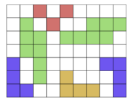

# Mikroorganizmi

**Omejitev časa:** 10 s  
**Omejitev pomnilnika:** 512 MiB  

Biolog se sklanja nad mikroskop in opazuje preparat. Rad bi preštel različne mikroorganizme. Napišite program, ki mu bo pomagal!

## Naloga

Vidno polje mikroskopa je predstavljeno z dvojiško matriko, vsaka povezana komponenta v matriki pa določa nek mikroorganizem. Povezana komponenta je množica, definirana s sledečimi pravili:

1. Vsaka enica pripada neki povezani komponenti.
2. Za vsako enico velja, da vse enice v njeni 4-sosesčini (ta je sestavljena iz leve, zgornje, desne in spodnje sosede) pripadajo isti povezani komponenti kot ta enica.

Povezane komponente, ki so druga glede na drugo zavrtene za 90, 180 ali 270 stopinj, obravnavamo kot različne pojavitve istega mikroorganizma, za zrcaljenja prek navpične ali vodoravne osi pa to ne velja nujno: če sta si povezani komponenti zrcalni sliki, lahko predstavljata dva različna mikroorganizma.

## Vhodni podatki

Prva vrstica vsebuje dve števili: višino `h` in širino `w` matrike. Nato sledi `h` vrstic s po `w` elementi, ki so lahko enice ali ničle (brez vmesnih presledkov).

### Omejitve vhodnih podatkov

- `1 ≤ h ≤ 2000`  
- `1 ≤ w ≤ 2000`

## Izhodni podatki

Izpišite število različnih mikroorganizmov.

## Komentar

Primer bo nadzornejši, če različne mikroorganizme pobarvamo z različnimi barvami:

Rezultat: 4
